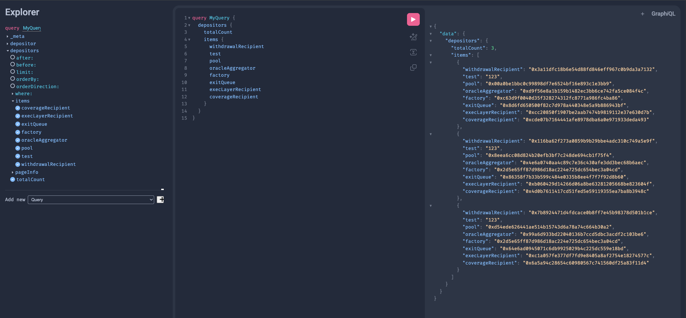

# Onchain Indexing

Playing around with [ponder](https://github.com/ponder-sh/ponder) to get some very simple onchain data. Namely, indexing Kiln smart contracts to get the list of vPools created by the [CoinbaseCloudOperator](https://explorer.kiln.fi/vfactories/0x2d5e65ff87d986d18ac224e725dc654bec3a04cd) on ETH mainnet. In summary, it works :smile::



## QuickStart

1. Put ETH archival node in `.env.local`:

    ```ini
    PONDER_RPC_URL_1="<url>"
    # (Optional) Postgres database URL. If not provided, local pglite will be used
    DATABASE_URL=
    ```

2. Run:

    ```bash
    npm run dev
    ```

3. Go to the Ponder Playground @ <http://localhost:42069>, run a query to see the data:

    ```gql
    query Test {
        _meta {
            status
        }
        distributions {
            totalCount
            items {
                amount
                distributor
                id
                token
            }
        }
        ownerTransfers {
            totalCount
            items {
                id
                newOwner
                oldOwner
            }
        }
        depositors {
            totalCount
            items {
                coverageRecipient
                execLayerRecipient
                exitQueue
                factory
                oracleAggregator
                pool
                test
                withdrawalRecipient
            }
        }
    }
    ```
